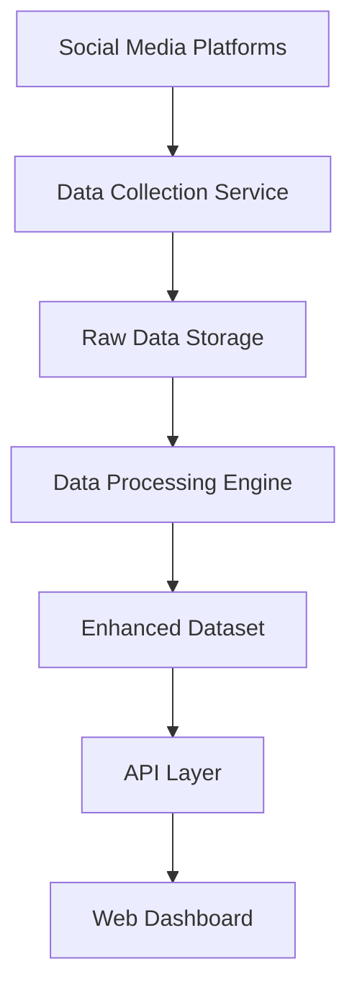

# Data Flow Documentation

## Overview
This document details how data flows from social media platforms through our processing pipeline into the Fashion Dashboard, providing businesses with actionable insights.

## Data Collection Process

### 1. Source Platforms
- **Instagram**: Fashion reels and posts via Instagram Basic Display API
- **TikTok**: Fashion videos via TikTok Research API
- **Substack**: Fashion newsletters via RSS feeds and web scraping

### 2. Data Collection Service
```python
# Example data collection service (pseudo-code)
class FashionDataCollector:
    def collect_instagram_data(self):
        # Collect reels and posts
        # Extract metadata: URL, category, engagement metrics
        pass
    
    def collect_tiktok_data(self):
        # Collect fashion videos
        # Extract metadata: URL, category, engagement metrics
        pass
    
    def collect_substack_data(self):
        # Parse RSS feeds
        # Extract article metadata
        pass
```

### 3. Data Processing Pipeline


## Data Enhancement Process

### 1. Raw Data Structure
```json
{
  "url": "https://www.instagram.com/reel/DOxv97ZisjR/",
  "platform": "Instagram",
  "content_type": "Video",
  "raw_metrics": {
    "views": 2340,
    "likes": 127,
    "comments": 45
  }
}
```

### 2. Enhanced Data Structure
```json
{
  "Category": "Assessing Fashion Needs",
  "URL": "https://www.instagram.com/reel/DOxv97ZisjR/",
  "Source": "Instagram",
  "Time_Spent_Minutes": 8.5,
  "Upvotes": 127,
  "Views": 2340,
  "Engagement_Score": 0.89,
  "Content_Type": "Video",
  "Difficulty_Level": "Intermediate",
  "Trending_Score": 0.92
}
```

### 3. Calculated Metrics

#### Engagement Score
```python
def calculate_engagement_score(views, upvotes, time_spent):
    # Normalize metrics to 0-1 scale
    normalized_views = min(views / 5000, 1.0)
    normalized_upvotes = min(upvotes / 300, 1.0)
    normalized_time = min(time_spent / 20, 1.0)
    
    # Weighted average
    engagement_score = (
        normalized_views * 0.4 +
        normalized_upvotes * 0.4 +
        normalized_time * 0.2
    )
    return round(engagement_score, 2)
```

#### Trending Score
```python
def calculate_trending_score(engagement_score, recency, growth_rate):
    # Factor in recency and growth rate
    recency_factor = max(0, 1 - (days_old / 30))
    growth_factor = min(growth_rate / 2, 1.0)
    
    trending_score = (
        engagement_score * 0.6 +
        recency_factor * 0.2 +
        growth_factor * 0.2
    )
    return round(trending_score, 2)
```

## API Data Flow

### 1. Data Endpoints
- `GET /api/data` - Retrieve all content data
- `GET /api/analytics` - Get aggregated analytics
- `GET /api/search?q={query}` - Search content
- `GET /api/categories` - Get category statistics

### 2. Data Transformation
```typescript
// API route handler
export async function GET() {
  const rawData = await loadCSVData()
  const processedData = rawData.map(item => ({
    ...item,
    // Add calculated fields
    engagement_tier: getEngagementTier(item.Engagement_Score),
    performance_grade: getPerformanceGrade(item.Trending_Score)
  }))
  
  return NextResponse.json(processedData)
}
```

## Dashboard Data Consumption

### 1. Real-time Updates
```typescript
// Dashboard data fetching
useEffect(() => {
  const fetchData = async () => {
    const response = await fetch('/api/data')
    const data = await response.json()
    setData(data)
  }
  
  fetchData()
  // Set up polling for real-time updates
  const interval = setInterval(fetchData, 30000) // 30 seconds
  return () => clearInterval(interval)
}, [])
```

### 2. Data Filtering and Search
```typescript
// Client-side filtering
const filteredData = useMemo(() => {
  return data.filter(item => {
    const matchesSearch = item.Category.toLowerCase().includes(searchTerm.toLowerCase())
    const matchesCategory = selectedCategory === 'All' || item.Category === selectedCategory
    const matchesSource = selectedSource === 'All' || item.Source === selectedSource
    
    return matchesSearch && matchesCategory && matchesSource
  })
}, [data, searchTerm, selectedCategory, selectedSource])
```

## Data Quality Assurance

### 1. Validation Rules
- URL format validation
- Numeric range validation for metrics
- Category classification verification
- Source platform verification

### 2. Data Cleaning
- Remove duplicate entries
- Handle missing values
- Standardize category names
- Validate engagement metrics

### 3. Error Handling
```typescript
// API error handling
try {
  const data = await processData(rawData)
  return NextResponse.json(data)
} catch (error) {
  console.error('Data processing error:', error)
  return NextResponse.json(
    { error: 'Failed to process data' }, 
    { status: 500 }
  )
}
```

## Performance Optimization

### 1. Data Caching
- Redis cache for frequently accessed data
- Browser-side caching for static data
- CDN caching for static assets

### 2. Data Pagination
```typescript
// Paginated API response
const paginatedData = {
  data: data.slice(offset, offset + limit),
  pagination: {
    page: currentPage,
    limit: limit,
    total: data.length,
    pages: Math.ceil(data.length / limit)
  }
}
```

### 3. Lazy Loading
- Load chart data on demand
- Implement virtual scrolling for large datasets
- Progressive data loading

## Security Considerations

### 1. Data Sanitization
- Sanitize user inputs
- Validate data before processing
- Escape special characters in URLs

### 2. Rate Limiting
```typescript
// API rate limiting
const rateLimit = new Map()

export async function GET(request: Request) {
  const ip = request.headers.get('x-forwarded-for') || 'unknown'
  const requests = rateLimit.get(ip) || 0
  
  if (requests > 100) { // 100 requests per hour
    return NextResponse.json({ error: 'Rate limit exceeded' }, { status: 429 })
  }
  
  rateLimit.set(ip, requests + 1)
  // Process request...
}
```

### 3. Data Privacy
- Anonymize user data
- Implement data retention policies
- Comply with GDPR requirements

## Monitoring and Analytics

### 1. Data Quality Metrics
- Data completeness percentage
- Processing error rates
- Data freshness indicators

### 2. Performance Metrics
- API response times
- Data processing duration
- Cache hit rates

### 3. Business Metrics
- Content engagement trends
- Category performance
- Source effectiveness

## Future Enhancements

### 1. Real-time Streaming
- WebSocket connections for live updates
- Event-driven data processing
- Real-time analytics

### 2. Machine Learning Integration
- Predictive analytics for content performance
- Automated category classification
- Trend prediction algorithms

### 3. Advanced Data Sources
- E-commerce platform integration
- Social media sentiment analysis
- Market research data integration

