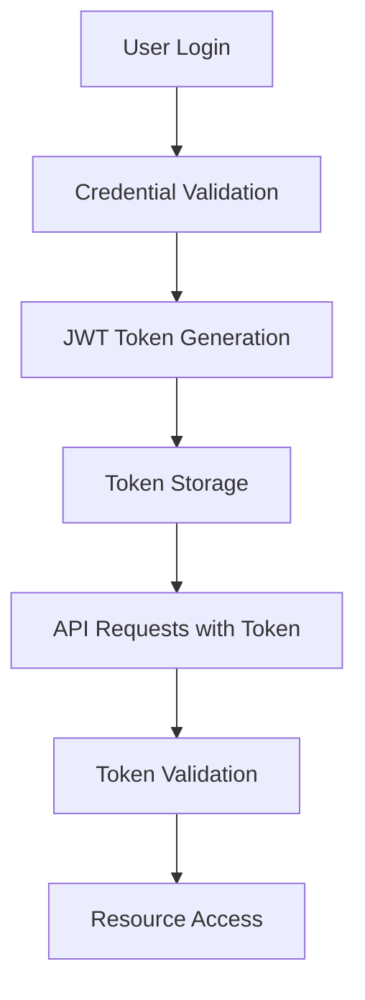

# Security Model Documentation

## Overview
This document outlines the security architecture for the Fashion Dashboard, covering both the current MVP implementation and future enterprise-grade security features.

## Security Phases

### Phase 1: MVP (Current Implementation)
**Target**: Public access with basic protection

#### Security Features
- **No Authentication Required**: Dashboard accessible without login
- **Data Sanitization**: All user inputs are sanitized and validated
- **Rate Limiting**: Basic protection against abuse and DDoS
- **HTTPS Only**: All communications encrypted in transit
- **Input Validation**: Client and server-side validation

#### Implementation Details
```typescript
// Rate limiting implementation
const rateLimits = new Map<string, { count: number; resetTime: number }>()

export function checkRateLimit(ip: string): boolean {
  const now = Date.now()
  const limit = rateLimits.get(ip)
  
  if (!limit || now > limit.resetTime) {
    rateLimits.set(ip, { count: 1, resetTime: now + 3600000 }) // 1 hour
    return true
  }
  
  if (limit.count >= 100) { // 100 requests per hour
    return false
  }
  
  limit.count++
  return true
}
```

#### Data Protection
- **Anonymized Data**: No personally identifiable information
- **Public Metrics Only**: Only aggregated, non-sensitive data
- **Content Filtering**: Remove sensitive or inappropriate content

### Phase 2: Authentication Required
**Target**: Business users with login credentials

#### Security Features
- **JWT Authentication**: Secure token-based authentication
- **Role-Based Access Control (RBAC)**: Different access levels
- **Session Management**: Secure session handling
- **API Key Management**: For programmatic access

#### Authentication Flow


#### Implementation
```typescript
// JWT authentication middleware
import jwt from 'jsonwebtoken'

export function authenticateToken(req: Request): boolean {
  const authHeader = req.headers['authorization']
  const token = authHeader && authHeader.split(' ')[1]
  
  if (!token) return false
  
  try {
    const decoded = jwt.verify(token, process.env.JWT_SECRET!)
    req.user = decoded
    return true
  } catch (error) {
    return false
  }
}
```

#### User Roles
1. **Viewer**: Read-only access to dashboard
2. **Analyst**: Access to advanced analytics and exports
3. **Admin**: Full access including user management
4. **API User**: Programmatic access with rate limits

### Phase 3: Enterprise Security
**Target**: Large organizations with advanced security requirements

#### Advanced Security Features
- **Single Sign-On (SSO)**: Integration with enterprise identity providers
- **Multi-Factor Authentication (MFA)**: Additional security layer
- **Audit Logging**: Comprehensive activity tracking
- **Data Encryption**: End-to-end encryption
- **Compliance**: GDPR, SOC 2, HIPAA compliance

#### SSO Integration
```typescript
// SAML/OAuth integration
export class SSOProvider {
  async authenticateWithSAML(samlResponse: string) {
    // Validate SAML response
    // Extract user attributes
    // Create or update user account
  }
  
  async authenticateWithOAuth(oauthToken: string) {
    // Validate OAuth token
    // Exchange for user information
    // Create session
  }
}
```

## Data Security

### 1. Data Classification
- **Public**: Aggregated metrics, non-sensitive insights
- **Internal**: Detailed analytics, business metrics
- **Confidential**: User data, proprietary algorithms
- **Restricted**: Financial data, personal information

### 2. Data Encryption
```typescript
// Data encryption at rest
import crypto from 'crypto'

export class DataEncryption {
  private static algorithm = 'aes-256-gcm'
  private static key = process.env.ENCRYPTION_KEY!
  
  static encrypt(text: string): string {
    const iv = crypto.randomBytes(16)
    const cipher = crypto.createCipher(this.algorithm, this.key)
    cipher.setAAD(Buffer.from('fashion-dashboard'))
    
    let encrypted = cipher.update(text, 'utf8', 'hex')
    encrypted += cipher.final('hex')
    
    const authTag = cipher.getAuthTag()
    return iv.toString('hex') + ':' + authTag.toString('hex') + ':' + encrypted
  }
}
```

### 3. Data Anonymization
```typescript
// Data anonymization for privacy
export function anonymizeData(data: any[]): any[] {
  return data.map(item => ({
    ...item,
    // Remove or hash sensitive fields
    user_id: hashUserId(item.user_id),
    ip_address: hashIP(item.ip_address),
    // Keep only necessary metrics
    category: item.category,
    engagement_score: item.engagement_score,
    timestamp: anonymizeTimestamp(item.timestamp)
  }))
}
```

## API Security

### 1. API Authentication
```typescript
// API key authentication
export function validateAPIKey(apiKey: string): boolean {
  const validKeys = process.env.API_KEYS?.split(',') || []
  return validKeys.includes(apiKey)
}

// Rate limiting per API key
const apiKeyLimits = new Map<string, { count: number; resetTime: number }>()

export function checkAPIKeyLimit(apiKey: string): boolean {
  const limit = apiKeyLimits.get(apiKey)
  const now = Date.now()
  
  if (!limit || now > limit.resetTime) {
    apiKeyLimits.set(apiKey, { count: 1, resetTime: now + 3600000 })
    return true
  }
  
  return limit.count < 1000 // 1000 requests per hour for API keys
}
```

### 2. Input Validation
```typescript
// Comprehensive input validation
import Joi from 'joi'

const searchSchema = Joi.object({
  query: Joi.string().max(100).pattern(/^[a-zA-Z0-9\s]*$/),
  category: Joi.string().valid('All', 'Assessing Fashion Needs', 'Style Principles', ...),
  source: Joi.string().valid('All', 'Instagram', 'TikTok', 'Substack'),
  limit: Joi.number().integer().min(1).max(100).default(50),
  offset: Joi.number().integer().min(0).default(0)
})

export function validateSearchInput(input: any) {
  const { error, value } = searchSchema.validate(input)
  if (error) {
    throw new Error(`Invalid input: ${error.details[0].message}`)
  }
  return value
}
```

### 3. CORS Configuration
```typescript
// CORS security configuration
export const corsOptions = {
  origin: process.env.ALLOWED_ORIGINS?.split(',') || ['http://localhost:3000'],
  methods: ['GET', 'POST', 'PUT', 'DELETE'],
  allowedHeaders: ['Content-Type', 'Authorization', 'X-API-Key'],
  credentials: true,
  maxAge: 86400 // 24 hours
}
```

## Infrastructure Security

### 1. Network Security
- **VPC**: Virtual Private Cloud for isolated network
- **Security Groups**: Restrictive firewall rules
- **WAF**: Web Application Firewall for DDoS protection
- **CDN**: Content Delivery Network with security features

### 2. Server Security
```yaml
# Docker security configuration
FROM node:18-alpine
RUN addgroup -g 1001 -S nodejs
RUN adduser -S nextjs -u 1001
USER nextjs
EXPOSE 3000
```

### 3. Database Security
- **Encryption at Rest**: Database-level encryption
- **Encryption in Transit**: SSL/TLS connections
- **Access Control**: Database user permissions
- **Backup Encryption**: Encrypted backups

## Monitoring and Incident Response

### 1. Security Monitoring
```typescript
// Security event logging
export class SecurityLogger {
  static logAuthAttempt(userId: string, success: boolean, ip: string) {
    console.log(JSON.stringify({
      event: 'auth_attempt',
      userId,
      success,
      ip,
      timestamp: new Date().toISOString()
    }))
  }
  
  static logDataAccess(userId: string, resource: string, action: string) {
    console.log(JSON.stringify({
      event: 'data_access',
      userId,
      resource,
      action,
      timestamp: new Date().toISOString()
    }))
  }
}
```

### 2. Incident Response Plan
1. **Detection**: Automated monitoring alerts
2. **Assessment**: Determine severity and impact
3. **Containment**: Isolate affected systems
4. **Investigation**: Root cause analysis
5. **Recovery**: Restore normal operations
6. **Lessons Learned**: Update security measures

### 3. Compliance Monitoring
- **GDPR**: Data protection compliance
- **SOC 2**: Security controls monitoring
- **Regular Audits**: Third-party security assessments

## Security Best Practices

### 1. Development Security
- **Secure Coding**: Follow OWASP guidelines
- **Dependency Scanning**: Regular vulnerability scans
- **Code Reviews**: Security-focused code reviews
- **Penetration Testing**: Regular security testing

### 2. Operational Security
- **Least Privilege**: Minimal necessary permissions
- **Regular Updates**: Keep dependencies updated
- **Backup Security**: Encrypted and tested backups
- **Access Monitoring**: Track all system access

### 3. User Education
- **Security Training**: Regular security awareness training
- **Phishing Prevention**: Email security best practices
- **Password Policies**: Strong password requirements
- **Incident Reporting**: Clear reporting procedures

## Security Roadmap

### Immediate (MVP)
- ✅ Basic rate limiting
- ✅ Input validation
- ✅ HTTPS enforcement
- ✅ Data sanitization

### Short-term (3-6 months)
- 🔄 JWT authentication
- 🔄 Role-based access control
- 🔄 API key management
- 🔄 Enhanced logging

### Long-term (6-12 months)
- 📋 SSO integration
- 📋 Multi-factor authentication
- 📋 Advanced monitoring
- 📋 Compliance certification

## Security Contacts

- **Security Team**: security@fashion-dashboard.com
- **Incident Response**: incident@fashion-dashboard.com
- **Compliance**: compliance@fashion-dashboard.com

## References

- [OWASP Top 10](https://owasp.org/www-project-top-ten/)
- [NIST Cybersecurity Framework](https://www.nist.gov/cyberframework)
- [GDPR Compliance Guide](https://gdpr.eu/)
- [SOC 2 Requirements](https://www.aicpa.org/interestareas/frc/assuranceadvisoryservices/aicpasoc2report)

